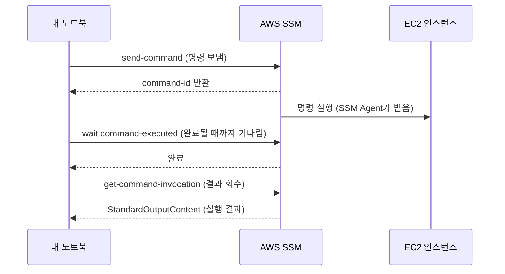
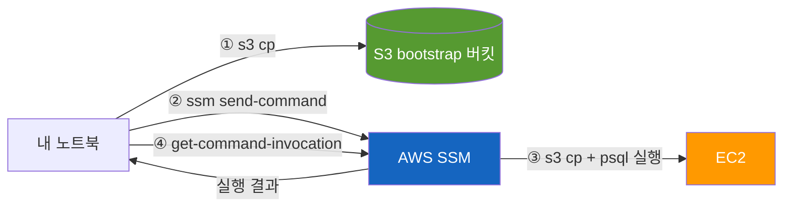

# 콘솔 대신 손에 익은 AWS CLI 패턴들 — 매일 치는 명령어 정리

## 들어가며

AWS 콘솔은 처음 배울 때는 좋아요. 어떤 리소스가 있는지 눈으로 보이고, 클릭하면 옵션이 다 나오니까요. 그런데 어느 순간부터 콘솔이 답답해져요.

- EC2 10대 중 어떤 게 어떤 서비스인지 보려면 콘솔 들어가서 태그 일일이 확인
- 로그 보려면 CloudWatch Logs 콘솔 → 로그그룹 클릭 → 스트림 클릭 → 새로고침
- EC2에서 명령어 한 줄 돌리려면 SSH 키 챙겨서 접속

CLI는 이걸 다 한 줄로 끝내요. 게다가 한 번 패턴을 잡아두면 다른 프로젝트에서도 그대로 재활용돼요.

이 글은 여러 프로젝트(사내툴, ERP, 커머스)를 운영하면서 **실제로 매일 치고 있는 AWS CLI 패턴**을 정리한 거예요. 깊은 옵션 레퍼런스가 아니라, "콘솔에서 자주 하던 그 작업, CLI로는 이렇게 한다" 위주로 풀게요.

AWS 콘솔은 만져봤지만 CLI는 막막한 1~3년차 분들 기준으로 썼어요.

## 1. 기본기 — 프로필·쿼리·아웃풋

CLI를 처음 만지면 가장 먼저 부딪히는 게 이 세 가지예요. 이것만 손에 익어도 절반은 끝났다고 봐요.

### 프로필 분리 — 회사 계정이 여러 개일 때

저는 프로젝트마다 AWS 계정이 다른데, `~/.aws/credentials`에 프로필을 따로 만들어둡니다.

```ini
# ~/.aws/credentials
[default]
aws_access_key_id = ...
aws_secret_access_key = ...

[myapp]
aws_access_key_id = ...
aws_secret_access_key = ...

[other-project]
aws_access_key_id = ...
aws_secret_access_key = ...
```

```ini
# ~/.aws/config
[profile myapp]
region = ap-northeast-2
output = json
```

매번 `--profile myapp`을 붙이거나, 한 세션 동안 환경변수로 박아두면 됩니다.

```bash
export AWS_PROFILE=myapp
```

작업 시작할 때 **무조건 먼저 치는 명령**이 이거예요. 엉뚱한 계정에 명령 날리면 진짜 곤란해져요.

```bash
aws sts get-caller-identity --profile myapp
```

출력:

```json
{
  "UserId": "AIDA...",
  "Account": "123456789012",
  "Arn": "arn:aws:iam::123456789012:user/me"
}
```

### `--query`로 필요한 것만 뽑기

AWS CLI 응답은 JSON이라 그대로 보면 눈이 빠져요. `--query`는 [JMESPath](https://jmespath.org/) 표현식으로 응답을 필터링해줍니다.

예를 들어 EC2 인스턴스 정보를 다 받으면 화면이 수십 줄인데, 이렇게 줄일 수 있어요.

```bash
aws ec2 describe-instances \
  --query 'Reservations[].Instances[].InstanceId'
```

### `--output table`로 사람이 읽기

JSON이 기본이지만, 사람이 보려고 할 땐 `table`이 훨씬 낫습니다.

```bash
aws ec2 describe-instances \
  --query 'Reservations[].Instances[].{id:InstanceId,type:InstanceType,state:State.Name}' \
  --output table
```

```
-----------------------------------------------------
|                DescribeInstances                  |
+----------------+-------------+--------------------+
|       id       |    type     |       state        |
+----------------+-------------+--------------------+
| i-0abc...      | t3.micro    | running            |
| i-0def...      | t4g.small   | running            |
+----------------+-------------+--------------------+
```

이 세 가지(`--profile`, `--query`, `--output table`) 조합이 거의 모든 read 명령에 들어가요. 손에 익혀두세요.

## 2. EC2 한눈에 보기

콘솔에서 EC2 목록 보는 그 작업, CLI로는 이거 한 줄이에요. 제가 작업 시작할 때 두 번째로 치는 명령입니다.

```bash
aws ec2 describe-instances \
  --filters Name=instance-state-name,Values=running \
  --query 'Reservations[].Instances[].{id:InstanceId,name:Tags[?Key==`Name`]|[0].Value,ip:PublicIpAddress,type:InstanceType}' \
  --output table
```

핵심은 **`Tags[?Key==\`Name\`]|[0].Value`** 패턴이에요. EC2의 Name 태그는 일반 속성이 아니라 태그 배열 안에 들어있어서, JMESPath 필터로 뽑아야 합니다.

결과:

```
----------------------------------------------------------------------
|                        DescribeInstances                           |
+----------------+---------------+----------------------+------------+
|       id       |     name      |          ip          |    type    |
+----------------+---------------+----------------------+------------+
| i-0abc...      | myapp-app     | 13.xx.xx.xx          | t3.micro   |
| i-0def...      | myapp-redis   | 15.xx.xx.xx          | t3.micro   |
+----------------+---------------+----------------------+------------+
```

이 한 줄을 zsh alias로 박아두면 진짜 자주 씁니다.

```bash
alias awsls='aws ec2 describe-instances --filters Name=instance-state-name,Values=running --query "Reservations[].Instances[].{id:InstanceId,name:Tags[?Key==\`Name\`]|[0].Value,ip:PublicIpAddress}" --output table'
```

## 3. SSM 3종 세트 — SSH를 대체한 운영 도구

여기가 이 글의 하이라이트예요. 저는 EC2에 거의 **SSH로 안 들어갑니다**. 대신 SSM(Systems Manager)으로 원격 명령을 보내요.

왜 SSM이 SSH보다 나은가:

- **키페어 관리가 없음**: `.pem` 파일 안 챙겨도 됨
- **포트 22를 열 필요 없음**: 보안그룹에서 SSH 인바운드 자체를 닫아둘 수 있음
- **모든 실행이 CloudTrail에 기록됨**: 누가 언제 뭘 실행했는지 다 남음
- **IAM으로 권한 제어**: 사람마다 어떤 EC2에 어떤 명령을 쓸 수 있는지 정책으로 거름

준비물은 두 가지뿐이에요.

1. EC2에 `AmazonSSMManagedInstanceCore` IAM Role 붙이기
2. EC2 안에 `amazon-ssm-agent` 설치 (Amazon Linux는 기본 설치돼 있음)

### 3종 세트 흐름



### 실제 명령

```bash
# 1. 명령 보내기
CMD_ID=$(aws ssm send-command \
  --instance-ids i-0abc... \
  --document-name AWS-RunShellScript \
  --parameters 'commands=["docker ps"]' \
  --query 'Command.CommandId' \
  --output text)

# 2. 완료될 때까지 기다리기
aws ssm wait command-executed \
  --command-id "$CMD_ID" \
  --instance-id i-0abc...

# 3. 결과 회수
aws ssm get-command-invocation \
  --command-id "$CMD_ID" \
  --instance-id i-0abc... \
  --query StandardOutputContent \
  --output text
```

처음엔 3줄이 귀찮아 보이지만, 한 번 셸 함수로 만들어두면 끝나요.

```bash
ssm-run() {
  local instance=$1
  local command=$2
  local cmd_id
  cmd_id=$(aws ssm send-command \
    --instance-ids "$instance" \
    --document-name AWS-RunShellScript \
    --parameters "commands=[\"$command\"]" \
    --query 'Command.CommandId' --output text)
  aws ssm wait command-executed --command-id "$cmd_id" --instance-id "$instance"
  aws ssm get-command-invocation \
    --command-id "$cmd_id" --instance-id "$instance" \
    --query StandardOutputContent --output text
}
```

사용:

```bash
ssm-run i-0abc... "docker ps"
ssm-run i-0abc... "df -h"
ssm-run i-0abc... "systemctl status myapp"
```

이게 익숙해지면 SSH가 답답해져요.

## 4. ECR + Docker — 한 줄 로그인

ECR에 push/pull 하려면 도커가 ECR에 로그인되어 있어야 해요. 매번 토큰을 발급받아 로그인하는데, 이게 명령어 한 줄로 끝납니다.

```bash
aws ecr get-login-password --region ap-northeast-2 \
  | docker login \
      --username AWS \
      --password-stdin 123456789012.dkr.ecr.ap-northeast-2.amazonaws.com
```

토큰은 12시간만 유효하니까, **로그인을 자동화 어딘가에 박아두는 게 핵심**이에요. 저는 systemd 유닛의 `ExecStartPre`에 이걸 넣어두고, 서비스가 시작될 때마다 새 토큰으로 로그인하게 해둡니다.

```ini
# /etc/systemd/system/myapp.service
[Service]
ExecStartPre=/bin/bash -c 'aws ecr get-login-password --region ap-northeast-2 | docker login --username AWS --password-stdin 123456789012.dkr.ecr.ap-northeast-2.amazonaws.com'
ExecStartPre=/usr/bin/docker pull 123456789012.dkr.ecr.ap-northeast-2.amazonaws.com/myapp:latest
ExecStart=/usr/bin/docker run --rm --name myapp ...
```

배포는 그냥 `systemctl restart myapp`. 그러면 알아서 로그인 → 풀 → 재기동이 돼요.

### 최근 푸시 이미지 확인

배포 후에 "내가 방금 푼 이미지가 진짜 올라갔나" 확인할 때:

```bash
aws ecr describe-images \
  --repository-name myapp \
  --query 'sort_by(imageDetails,&imagePushedAt)[-5:].[imageTags[0],imagePushedAt]' \
  --output table
```

최신 5개 이미지가 푸시 시각과 같이 깔끔하게 나옵니다.

## 5. 실시간 로그 디버깅 — `logs tail`

CloudWatch Logs를 콘솔에서 보면 진짜 답답해요. 새로고침 직접 눌러야 하고, 검색도 느리고. CLI엔 `aws logs tail`이 있어요.

```bash
# 실시간 follow (tail -f 같은 느낌)
aws logs tail /myapp/server --follow --format short

# 최근 1시간 + 에러만
aws logs tail /myapp/server --since 1h --format short | grep -i error

# 최근 6시간 마지막 100줄
aws logs tail /aws/lambda/myapp-worker --since 6h --format short | tail -100
```

`--format short`가 핵심이에요. 기본 출력은 타임스탬프가 너무 길어서 가독성이 떨어집니다.

`logs tail`은 **최근 로그**에 강해요. 시간 범위가 며칠 단위로 넘어가거나, 특정 패턴으로 본격적으로 뒤져야 할 땐 `aws logs filter-log-events`가 더 낫습니다. 일단은 `tail --follow`만 손에 익혀도 디버깅이 훨씬 빨라져요.

## 6. SSM Parameter Store — `.env`를 EC2에서 없애기

`.env` 파일을 EC2 안에 두는 거, 저는 안 좋아해요. 누가 SSH로 들어가서 `cat`할 수 있고, 백업 떠지면 시크릿이 같이 따라가고, 값 바꾸려면 EC2에 들어가야 해요.

SSM Parameter Store는 시크릿/환경변수를 AWS 안에 통째로 모아두고, EC2는 부팅할 때나 컨테이너 시작할 때 받아오는 방식이에요.

### 값 넣기

```bash
aws ssm put-parameter \
  --name /myapp/prod/DATABASE_URL \
  --value 'postgresql://...' \
  --type SecureString \
  --overwrite
```

`SecureString`은 KMS로 자동 암호화돼요.

### 받아서 환경변수로 만들기

```bash
aws ssm get-parameters-by-path \
  --path /myapp/prod/ \
  --recursive \
  --with-decryption \
  --query 'Parameters[].[Name,Value]' \
  --output text \
  | while read name value; do
      key=$(basename "$name")
      echo "export $key='$value'"
    done > /tmp/myapp.env

source /tmp/myapp.env
```

이걸 EC2 부팅 스크립트(`/etc/systemd/system/myapp.service`의 `EnvironmentFile`이나 시작 스크립트)에 박아두면, **`.env` 파일이 EC2 디스크에 영구적으로 남지 않아요**. 값을 바꿀 때도 콘솔이나 CLI에서 `put-parameter`만 하면 끝.

## 7. 일회성 운영 작업 — SSH 대신 S3 + SSM

마지막으로, 제가 자주 만나는 시나리오 하나. **"프로덕션 EC2에서 SQL 한 번 돌려야 한다"** 같은 일회성 작업이에요.

기존 방식이라면:

1. SSH 키 챙겨서 EC2 접속
2. `vim`으로 SQL 파일 만들기
3. `psql ... -f query.sql`
4. 결과 복사해서 슬랙에 붙여 넣기

이 흐름은 **누가 언제 뭘 돌렸는지 흔적이 안 남고**, EC2 안에 임시 파일이 쌓여요.

S3 + SSM 조합으로 바꾸면 이렇게 돼요.



실제 명령은 이런 식이에요.

```bash
# ① 로컬에서 SQL 만들어서 S3에 던지기
echo "SELECT count(*) FROM orders WHERE created_at >= '2026-05-01';" > /tmp/q.sql
aws s3 cp /tmp/q.sql s3://myapp-bootstrap/q.sql

# ② EC2에서 받아 실행시키기
CMD_ID=$(aws ssm send-command \
  --instance-ids i-0abc... \
  --document-name AWS-RunShellScript \
  --parameters 'commands=[
    "aws s3 cp s3://myapp-bootstrap/q.sql /tmp/q.sql",
    "psql $DATABASE_URL -f /tmp/q.sql"
  ]' \
  --query 'Command.CommandId' --output text)

# ③ 기다리고
aws ssm wait command-executed --command-id "$CMD_ID" --instance-id i-0abc...

# ④ 결과 회수
aws ssm get-command-invocation \
  --command-id "$CMD_ID" --instance-id i-0abc... \
  --query StandardOutputContent --output text
```

이 워크플로의 장점:

- **SSH 키 0개**: EC2에 22번 포트 열 필요 없음
- **모든 실행이 CloudTrail에 기록**: 누가 언제 뭘 돌렸는지 다 남음
- **결과가 텍스트로 떨어짐**: 그대로 슬랙/문서에 붙여 넣기 좋음
- **재현 가능**: 같은 SQL을 다시 돌리고 싶으면 `send-command`만 다시 치면 됨

매일 돌리는 작업은 아니지만, **가끔 돌리는데 매번 헷갈리는** 종류의 작업이에요. 셸 함수로 묶어두면 그 다음부턴 한 번에 끝납니다.

## 마무리

여기까지 정리한 패턴들이 제가 일하면서 거의 매일 손이 가는 명령어예요. 정리해보면 결국 몇 가지 원칙으로 수렴해요.

1. **작업 시작할 때 `sts get-caller-identity`**로 계정부터 확인
2. **모든 read 명령에 `--query` + `--output table`** — 가독성이 다름
3. **EC2 운영은 SSM으로** — SSH는 정말 필요할 때만
4. **시크릿은 Parameter Store에** — `.env`를 EC2에 두지 않기
5. **로그는 `logs tail --follow --format short`** — 콘솔보다 훨씬 빠름

CLI에 익숙해지면 그다음 자연스럽게 가는 곳이 **CloudFormation이나 CDK** 같은 IaC예요. "이 리소스 만드는 CLI 명령어 5줄을 매번 치느니, 그냥 코드로 박아두자"가 되거든요. 그 얘기는 다음에 따로 정리할게요.

처음 시작할 때는 위 명령들 중 **`describe-instances` + `--output table`** 하나만 손에 익혀보세요. 콘솔이 답답해지기 시작하면 나머지는 자연스럽게 따라옵니다.
