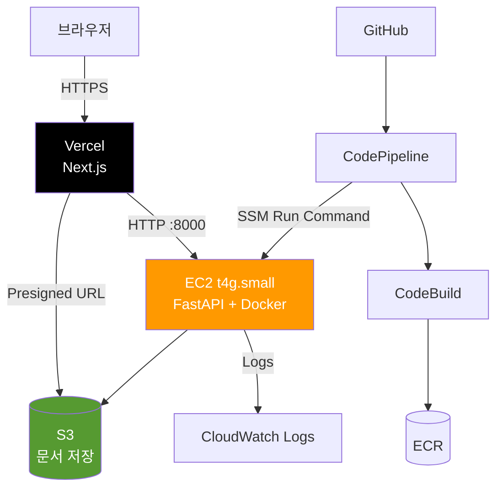
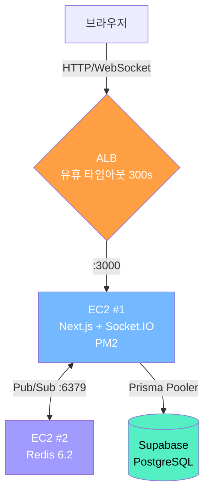
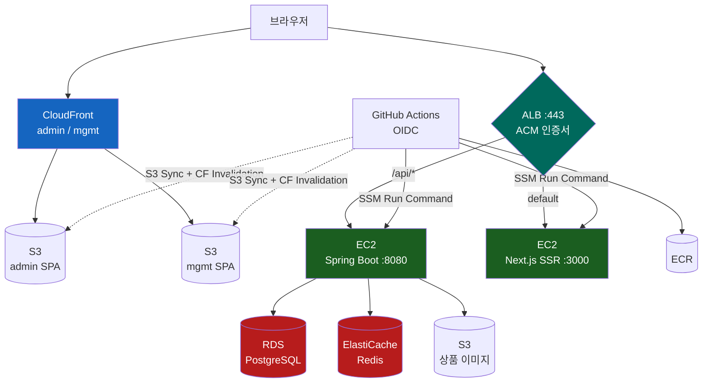

# 내가 자주 쓰는 AWS 인프라 구조 정리 — 규모별 3단계

## 들어가며

AWS 콘솔을 열어보면 서비스가 200개가 넘어요. EC2, RDS, S3 정도는 다들 한 번씩 만져봤을 텐데, 정작 "이걸 어떻게 묶어야 하나"는 잘 안 와닿더라고요. 저도 그랬어요.

이 글은 제가 실제로 운영 중인 세 프로젝트 — **사내툴**, **ERP**, **커머스** — 의 인프라 구성을 정리한 글이에요. 세 프로젝트가 트래픽과 요구사항이 달라서, 인프라도 자연스럽게 단계가 나뉘었어요. 그 단계를 따라가면서 "왜 이 컴포넌트가 추가됐는지"를 짚어볼게요.

각 AWS 서비스가 뭐 하는 건지는 한 번씩 만져봤지만, 전체 그림이 흐릿한 1~3년차 개발자를 가정하고 썼어요.

## 공통 빌딩블록

세 프로젝트가 어떤 규모든 공통으로 깔리는 게 있어요. 이게 "내 표준 베이스"라고 생각하면 돼요.

### 네트워크 — VPC와 보안그룹 체인

모든 EC2는 **VPC 안**에 있고, 컴포넌트마다 **Security Group**을 하나씩 만들어요. 핵심은 보안그룹을 **체인으로 묶는 것**이에요.

```
인터넷 → ALB-SG (80/443)
           ↓
        App-SG (3000 from ALB-SG)
           ↓
        DB-SG (5432 from App-SG)
           ↓
        Redis-SG (6379 from App-SG)
```

각 보안그룹의 인바운드를 **IP가 아니라 "어떤 SG에서 오는지"** 로 거는 거예요. 이렇게 하면 EC2 IP가 바뀌어도 룰을 안 고쳐도 되고, 외부에서 직접 DB에 붙는 경로가 원천 차단돼요.

### 컴퓨팅 — EC2 + EIP

저는 아직 ECS/Fargate보다 **EC2 + Docker** 조합을 많이 써요. 이유는 단순해요. 비용 예측이 쉽고, SSH로 직접 들어가서 디버깅하기 편하고, t3/t4g.micro 정도면 작은 서비스는 충분히 굴러가요.

EC2에는 항상 **Elastic IP**를 붙여요. 인스턴스를 재시작해도 퍼블릭 IP가 유지되니까, DNS 레코드나 외부 서비스 화이트리스트가 깨지지 않아요.

### 저장소 — S3 + ECR

- **S3**: 사용자 업로드, 정적 에셋. 프론트에서는 Presigned URL로 직접 업로드/다운로드.
- **ECR**: Docker 이미지 레지스트리. 거의 모든 배포가 ECR을 거쳐가요.

### 운영 — CloudWatch Logs + SSM Parameter Store

- **CloudWatch Logs**: EC2 안의 컨테이너 로그를 모아두는 곳. `aws logs tail`로 실시간 추적 가능.
- **SSM Parameter Store**: 환경변수와 시크릿 저장소. `.env` 파일을 EC2에 흩뿌리지 않고, 배포 스크립트가 SSM에서 가져와서 컨테이너에 주입해요.

### DB — Supabase

세 프로젝트 모두 **DB는 Supabase**(외부 PostgreSQL)를 써요. RDS를 안 쓰는 게 아니라(커머스는 RDS도 같이 써요), 작은~중간 규모에서는 Supabase가 백업, 인증, Realtime까지 묶어주니까 운영 부담이 훨씬 적어요.

---

## Level 1 — 작은 서비스 (사내툴 패턴)

가장 단순한 구성이에요. **EC2 한 대 + S3 + CodePipeline**.



### 구성 요약

- **프론트**: Vercel (Next.js). AWS 밖이에요. 작은 서비스에서 Next.js를 EC2로 굳이 끌고 올 이유가 없어요.
- **백엔드**: EC2 1대. FastAPI 컨테이너가 8000 포트로 떠있어요.
- **저장소**: S3. 사용자 업로드는 Vercel → Presigned URL → S3 직접 업로드.
- **배포**: GitHub push → CodePipeline → CodeBuild로 Docker 이미지 빌드 → ECR push → SSM Run Command로 EC2에서 `docker pull && restart`.

### 왜 ALB를 안 썼나

ALB는 월 $20 정도 고정 비용이 나와요. 사내툴처럼 **단일 EC2 + 단일 도메인**이면, EIP에 직접 도메인 박는 게 훨씬 싸요. HTTPS가 필요하면 EC2 안의 nginx에 Let's Encrypt를 깔거나, 앞단에 CloudFront를 두면 돼요.

ALB는 **트래픽 분산**이 필요하거나 **여러 서비스를 한 도메인으로 묶을 때** 들어가요. 그 시점이 오기 전엔 굳이 안 써요.

---

## Level 2 — 실시간성이 필요한 서비스 (ERP 패턴)

ERP에는 **재고 예약**이나 **알림** 같은 실시간 기능이 들어가요. WebSocket과 Redis가 추가되면서 구조가 한 단계 올라가요.



### 새로 들어온 컴포넌트

**ALB (Application Load Balancer)**
- WebSocket을 쓰려면 ALB의 **유휴 타임아웃을 300초 이상**으로 늘려야 해요. 기본값 60초로는 연결이 자꾸 끊겨요.
- **스티키 세션**(lb_cookie)을 켜요. Socket.IO는 첫 연결 후 같은 서버로 계속 붙어야 하니까요.
- 향후 EC2를 늘릴 때를 대비해서, **트래픽이 한 대일 때부터** ALB를 깔아두는 게 편해요. 나중에 끼우려면 도메인/SSL 다 다시 만져야 하거든요.

**Redis (별도 EC2)**
- ElastiCache가 정석이지만, **t3.micro EC2에 Redis 6.2 직접 띄우는 게 훨씬 싸요**(월 $10 vs $15+). 대신 백업/페일오버는 직접 해야 해요.
- 용도: Socket.IO 어댑터(Pub/Sub) + 분산 락 + 캐시.
- 재고 예약은 **Redis Lua 스크립트로 원자적 처리**해요. DB 락보다 훨씬 빠르고 안전해요.

### 보안그룹 체인

```
ALB-SG : 80/443 from 0.0.0.0/0
App-SG : 3000 from ALB-SG / 22 from 관리자 IP
Redis-SG : 6379 from App-SG / 22 from 관리자 IP
```

Redis 포트는 **앱 SG에서만** 열어요. 외부에서 6379로 직접 못 들어와요.

---

## Level 3 — 본격 프로덕션 (커머스 패턴)

여러 클라이언트(고객용 SSR, 관리자 SPA, 운영 SPA)와 본격적인 DB가 들어가요.



### 정적 vs SSR — 갈리는 기준

- **관리자/운영 페이지**: React SPA (Vite/CRA) → S3 + CloudFront. 로그인 뒤에만 쓰는 페이지라 **SEO 불필요**, 사용자 수가 적음. 서버를 굳이 띄울 필요가 없어요.
- **고객용 메인 사이트**: Next.js SSR → EC2. **SEO 필요**, 초기 렌더가 빨라야 함. 그래서 컴퓨팅이 필요해요.

### ALB 경로 기반 라우팅

ALB 하나로 두 EC2(백엔드/프론트엔드)를 묶어요.

```
example.com/api/*     → backend-tg :8080
api.example.com       → backend-tg :8080
example.com (default) → client-tg :3000
```

도메인이 하나라서 **CORS 이슈가 없어요**. 이게 ALB 경로 라우팅의 가장 큰 장점이에요.

### 배포 자동화 — GitHub Actions + OIDC

CodePipeline 대신 **GitHub Actions를 OIDC로 AWS에 연결**해요. AccessKey를 GitHub Secrets에 박지 않아도 돼요.

```
GitHub Actions
  → AWS STS (OIDC) → 임시 자격증명 발급
  → ECR push (Docker 이미지)
  → SSM Run Command → EC2에서 deploy.sh 실행
  → docker pull && docker restart
```

정적 사이트는 더 간단해요. **S3 sync → CloudFront invalidation** 두 줄이면 끝나요.

### SSM Parameter Store가 빛나는 순간

서비스가 많아지면 환경변수가 폭발해요. 커머스는 50개 가까이 돼요(DB, JWT, OAuth, S3, Redis, 외부 API 키들...). 이걸 전부 `/myapp/prod/` 같은 경로에 모아두고, EC2 부팅 스크립트나 deploy.sh에서 한 번에 가져와서 컨테이너에 주입해요.

`.env` 파일 안 만들어도 되고, 시크릿 로테이션도 콘솔에서 값만 바꾸면 끝나요.

---

## 단계별로 정리

| 컴포넌트 | Level 1 (사내툴) | Level 2 (ERP) | Level 3 (커머스) |
|---------|----------------|---------------|-----------------|
| 프론트 | Vercel | EC2 | EC2(SSR) + S3+CF(SPA) |
| 백엔드 | EC2 1대 | EC2 1대 | EC2 1대 (백/프론트 분리) |
| 로드밸런서 | ❌ | ALB | ALB (경로 라우팅) |
| 캐시/실시간 | ❌ | EC2 Redis | ElastiCache Redis |
| DB | Supabase | Supabase | RDS + Supabase |
| CDN | ❌ | ❌ | CloudFront |
| 배포 | CodePipeline | 수동/스크립트 | GitHub Actions OIDC |
| 이미지 저장 | S3 | ❌ | S3 + CloudFront |

핵심은 **필요해질 때 하나씩 추가**한다는 거예요. 처음부터 ALB, ElastiCache, CloudFront 다 깔면 비용은 비용대로 나가고 운영 부담만 늘어나요.

---

## 공통 운영 패턴

규모와 무관하게 세 프로젝트에서 똑같이 쓰는 것들이에요.

### 1. SSM Run Command로 배포

SSH로 들어가서 명령어 치는 시대는 지났어요. EC2에 IAM Role만 붙여두면, CI에서 `aws ssm send-command`로 원격 실행이 돼요. 키페어 관리도 줄고, **누가 언제 뭘 실행했는지 CloudTrail에 다 남아요**.

### 2. 보안그룹 체인

위에서 본 `ALB-SG → App-SG → DB-SG` 구조는 모든 프로젝트에 그대로 적용돼요. **포트는 항상 "from SG"로만** 열어요.

### 3. SSM Parameter Store에 시크릿 집중

`.env`를 EC2에 두지 않아요. 배포 스크립트가 SSM에서 받아와서 컨테이너에 환경변수로 주입해요. 로컬 개발자는 SSM 권한이 있는 사람만 `aws ssm get-parameters`로 받아갈 수 있어요.

### 4. CloudWatch Logs로 로그 통합

`docker logs`를 직접 보는 일이 거의 없어요. EC2의 CloudWatch agent가 컨테이너 stdout을 그대로 빨아들여서 한 곳에 모아줘요. `aws logs tail --follow`가 실시간 디버깅의 기본기예요.

---

## 마무리

세 프로젝트를 운영하면서 느낀 건, **인프라는 한 번에 완성되지 않는다**는 거예요. 트래픽이 0인 시점에 ECS/Fargate 깔고 RDS Multi-AZ 켜봐야 비용만 나가요. 반대로 트래픽이 늘어났는데 EC2 한 대로 버티고 있으면 한밤중에 깨요.

지금 운영 중인 구성에서 다음 단계로 갈 만한 후보는 이런 것들이에요.

- **EC2 → ECS/Fargate**: 자동 복구가 절실해질 때
- **Redis EC2 → ElastiCache**: 데이터 유실이 비즈니스 임팩트가 될 때
- **RDS 단일 AZ → Multi-AZ + Read Replica**: DB 장애가 곧 매출 손실일 때
- **Route 53 + Health Check + Failover**: 리전 장애까지 대비해야 할 때

각각이 들어올 때마다 "왜 지금 이게 필요한가"를 한 번씩 따져보는 습관이 인프라 운영에서 가장 중요한 것 같아요.

다음 글에서는 이 중 하나 — 아마도 **GitHub Actions OIDC + SSM 배포 파이프라인** — 을 직접 따라 만들어보는 핸즈온으로 풀어볼게요.
