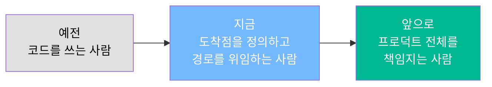

# AI 사용 기록 3개월 반을 분석해봤더니

## 들어가며

어느 날 문득 이런 생각이 들었어요. "내가 요즘 코드를 직접 들여다본 게 언제였지?"

기능 하나를 붙이고, 버그를 잡고, 배포까지 했는데 정작 diff를 한 줄씩 따라 읽은 기억이 없더라고요. 그렇다고 대충 한 것도 아니에요. 오히려 예전보다 결과물은 더 많이 나오고 있었어요. 뭔가 일하는 방식이 근본적으로 바뀌었는데, 그게 정확히 무엇인지는 말로 설명이 안 됐어요.

마침 Claude Code랑 Codex 세션 기록을 DB에 동기화해두고 있었어요. 그래서 3개월 반 치를 전부 뽑아서 분석해봤습니다. 감각으로만 느끼던 게 숫자로 찍히니까 그제야 설명이 되더라고요.

이 글은 그 분석 결과와, 숫자가 알려준 변화에 대한 이야기예요. AI를 매일 쓰고는 있는데 "그래서 내가 예전이랑 뭐가 달라진 거지?"가 잘 안 잡히는 분들을 생각하면서 썼어요.

## 얼마나 쓰고 있었나

2026년 5월 말부터 9월 중순까지, 세션 1,251건에 제가 직접 친 프롬프트가 4,363건이었어요. 누적 입력 토큰은 81억이고, 실제로 작업한 날은 46일이에요.

실작업일 기준으로 나누면 하루 평균 27세션이에요. 일하는 날엔 거의 붙어 있었다는 뜻이죠. 더 눈에 띄는 건 증가 속도인데, 8월 한 달치 세션 수를 9월이 17일 만에 93% 따라잡았어요. 쓰는 양 자체가 계속 늘고 있어요.

그런데 총량보다 훨씬 많은 걸 설명해준 숫자가 따로 있었어요.

### 입력 81억 토큰, 출력 3,869만 토큰

비율로 따지면 209 대 1이에요.

<figure>
<svg viewBox="0 0 640 220" role="img" aria-label="누적 입력 81억 토큰과 출력 3869만 토큰의 면적 비교">
  <rect x="0" y="0" width="640" height="220" fill="#faf9f7" rx="6"></rect>

  <text x="24" y="34" font-size="13" font-weight="600" fill="#1a1c22">입력 81.0억</text>
  <rect x="24" y="46" width="404" height="140" fill="#3d5a80" rx="3"></rect>
  <text x="38" y="124" font-size="34" font-weight="600" fill="#ffffff" font-family="ui-monospace, monospace">209</text>
  <text x="38" y="148" font-size="12" fill="#d8e0ea">읽히고 판단시키는 데 쓴 토큰</text>

  <text x="470" y="34" font-size="13" font-weight="600" fill="#1a1c22">출력 3,869만</text>
  <rect x="470" y="46" width="146" height="17" fill="#b4763a" rx="2"></rect>
  <text x="470" y="82" font-size="26" font-weight="600" fill="#b4763a" font-family="ui-monospace, monospace">1</text>
  <text x="470" y="104" font-size="12" fill="#4a4f5c">실제로 생성된 코드·문서</text>
  <line x1="470" y1="120" x2="616" y2="120" stroke="#cfcec8" stroke-width="1"></line>
  <text x="470" y="142" font-size="11.5" fill="#7b8191">같은 비율로 그리면</text>
  <text x="470" y="160" font-size="11.5" fill="#7b8191">왼쪽 박스 높이의 0.5%</text>

  <text x="24" y="208" font-size="11" fill="#7b8191" font-family="ui-monospace, monospace">면적 = 토큰량 비례 · 입력 : 출력 = 209 : 1</text>
</svg>
<figcaption>누적 입력 81.0억 vs 출력 3,869만 토큰</figcaption>
</figure>

처음엔 오류인 줄 알았어요. AI한테 코드를 쓰게 시키는 거라면 출력이 이렇게까지 적을 리가 없잖아요. 그런데 뜯어보니 당연한 결과였어요. 저는 코드를 대량으로 뽑아내는 데 AI를 쓰고 있는 게 아니었어요. **기존 코드를 읽히고, 상황을 파악시키고, 판단하게 하는 데** 토큰이 쏠려 있었던 거예요.

입력 중 97%가 캐시 재사용이라는 점도 같은 이야기를 해요. 긴 세션을 유지하면서 같은 맥락을 계속 참조시키는 구조로 굳어져 있다는 뜻이거든요. 새 창을 열고 처음부터 설명하는 대신, 프로젝트 하나를 통째로 이해시켜놓고 그 위에서 계속 지시하는 식이에요.

### 1번 지시에 7.3번 응답

위임 수준을 보여주는 숫자도 있었어요.

제가 친 프롬프트가 4,363건인데 AI가 보낸 메시지는 31,786건이에요. 한 번 시키면 7.3번 답한다는 뜻이고, 세션당 도구 호출은 평균 13.5회예요. 짧게 한 마디 던지면 그동안 파일을 십여 번 읽고 고친다는 거죠.

중간에 끊은 횟수(interrupt)는 82회로 전체 프롬프트의 1.9%밖에 안 됐어요. 방향이 틀렸다 싶어서 멈춰 세우는 일이 거의 없다는 거예요. 이 숫자를 보고 나서야 "아, 내가 경로를 안 보고 있구나"가 확실해졌어요.

### 프롬프트의 35%가 30자 이하

프롬프트 길이 분포가 특히 재미있었어요.

<figure>
<svg viewBox="0 0 640 260" role="img" aria-label="프롬프트 길이 분포 막대 그래프">
  <rect x="0" y="0" width="640" height="260" fill="#faf9f7" rx="6"></rect>

  <line x1="150" y1="30" x2="150" y2="205" stroke="#cfcec8" stroke-width="1"></line>

  <text x="140" y="52" font-size="12.5" fill="#4a4f5c" text-anchor="end">≤ 30자</text>
  <rect x="150" y="38" width="163" height="22" fill="#3d5a80" rx="2"></rect>
  <text x="323" y="54" font-size="12.5" font-weight="600" fill="#1a1c22" font-family="ui-monospace, monospace">1,530 · 35.1%</text>

  <text x="140" y="96" font-size="12.5" fill="#4a4f5c" text-anchor="end">31 – 300자</text>
  <rect x="150" y="82" width="211" height="22" fill="#3d5a80" rx="2"></rect>
  <text x="371" y="98" font-size="12.5" font-weight="600" fill="#1a1c22" font-family="ui-monospace, monospace">1,978 · 45.3%</text>

  <text x="140" y="140" font-size="12.5" fill="#4a4f5c" text-anchor="end">301 – 3,000자</text>
  <rect x="150" y="126" width="58" height="22" fill="#8aa0bb" rx="2"></rect>
  <text x="218" y="142" font-size="12.5" fill="#4a4f5c" font-family="ui-monospace, monospace">547 · 12.5%</text>

  <text x="140" y="184" font-size="12.5" fill="#4a4f5c" text-anchor="end">3,000자 +</text>
  <rect x="150" y="170" width="33" height="22" fill="#b4763a" rx="2"></rect>
  <text x="193" y="186" font-size="12.5" font-weight="600" fill="#b4763a" font-family="ui-monospace, monospace">308 · 7.1%</text>

  <line x1="150" y1="205" x2="616" y2="205" stroke="#cfcec8" stroke-width="1"></line>

  <text x="150" y="228" font-size="11.5" fill="#7b8191" font-family="ui-monospace, monospace">중앙값 57자 · 평균 1,201자 · n = 4,363</text>
  <text x="150" y="246" font-size="11.5" fill="#b4763a" font-family="ui-monospace, monospace">주황 7.1%가 평균을 1,201자까지 끌어올린다</text>
</svg>
<figcaption>프롬프트 길이 분포 — 짧은 승인이 바닥에 깔리고 장문 스펙이 얹히는 이중 구조</figcaption>
</figure> 중앙값은 57자인데 평균은 1,201자예요. 이 격차가 핵심이에요.

제가 제일 많이 반복한 프롬프트를 세어보니 이랬어요.

```
진행해          ×83
continue       ×58
좋아 진행해      ×54
커밋하고 푸시해   ×45
좋아            ×28
```

짧은 승인이 바닥에 대량으로 깔려 있고, 그 위에 3,000자 넘는 장문 스펙이 얹히는 이중 구조예요. 긴 프롬프트는 전체의 7%밖에 안 되는데 평균을 1,201자까지 끌어올리고 있었어요.

이 이중 구조가 뒤에서 이야기할 변화의 정체예요.

## 사용 범위 — 코드는 일부일 뿐이었어요

무엇을 시키고 있는지도 분류해봤어요. 프롬프트 본문을 키워드로 나눈 거라 중복은 있지만, 대략의 분포는 보여요.

<figure>
<svg viewBox="0 0 640 350" role="img" aria-label="작업 유형별 프롬프트 수 막대 그래프">
  <rect x="0" y="0" width="640" height="350" fill="#faf9f7" rx="6"></rect>
  <line x1="168" y1="26" x2="168" y2="322" stroke="#cfcec8" stroke-width="1"></line>
  <text x="158" y="48" font-size="12.5" fill="#4a4f5c" text-anchor="end">조사·설명·리뷰</text>
  <rect x="168" y="34" width="380" height="19" fill="#b4763a" rx="2"></rect>
  <text x="557" y="48" font-size="12" font-weight="600" fill="#1a1c22" font-family="ui-monospace, monospace">890</text>
  <text x="158" y="77" font-size="12.5" fill="#4a4f5c" text-anchor="end">신규 구현·기능 추가</text>
  <rect x="168" y="63" width="357" height="19" fill="#3d5a80" rx="2"></rect>
  <text x="534" y="77" font-size="12" font-weight="400" fill="#1a1c22" font-family="ui-monospace, monospace">837</text>
  <text x="158" y="106" font-size="12.5" fill="#4a4f5c" text-anchor="end">UI·디자인</text>
  <rect x="168" y="92" width="346" height="19" fill="#3d5a80" rx="2"></rect>
  <text x="523" y="106" font-size="12" font-weight="400" fill="#1a1c22" font-family="ui-monospace, monospace">810</text>
  <text x="158" y="135" font-size="12.5" fill="#4a4f5c" text-anchor="end">커밋·git</text>
  <rect x="168" y="121" width="336" height="19" fill="#b4763a" rx="2"></rect>
  <text x="513" y="135" font-size="12" font-weight="600" fill="#1a1c22" font-family="ui-monospace, monospace">787</text>
  <text x="158" y="164" font-size="12.5" fill="#4a4f5c" text-anchor="end">배포·인프라</text>
  <rect x="168" y="150" width="330" height="19" fill="#3d5a80" rx="2"></rect>
  <text x="507" y="164" font-size="12" font-weight="400" fill="#1a1c22" font-family="ui-monospace, monospace">773</text>
  <text x="158" y="193" font-size="12.5" fill="#4a4f5c" text-anchor="end">버그·오류 수정</text>
  <rect x="168" y="179" width="288" height="19" fill="#3d5a80" rx="2"></rect>
  <text x="465" y="193" font-size="12" font-weight="400" fill="#1a1c22" font-family="ui-monospace, monospace">675</text>
  <text x="158" y="222" font-size="12.5" fill="#4a4f5c" text-anchor="end">문서·보고서</text>
  <rect x="168" y="208" width="256" height="19" fill="#3d5a80" rx="2"></rect>
  <text x="433" y="222" font-size="12" font-weight="400" fill="#1a1c22" font-family="ui-monospace, monospace">600</text>
  <text x="158" y="251" font-size="12.5" fill="#4a4f5c" text-anchor="end">테스트·검증</text>
  <rect x="168" y="237" width="213" height="19" fill="#3d5a80" rx="2"></rect>
  <text x="390" y="251" font-size="12" font-weight="400" fill="#1a1c22" font-family="ui-monospace, monospace">500</text>
  <text x="158" y="280" font-size="12.5" fill="#4a4f5c" text-anchor="end">리팩터·개선</text>
  <rect x="168" y="266" width="212" height="19" fill="#3d5a80" rx="2"></rect>
  <text x="389" y="280" font-size="12" font-weight="400" fill="#1a1c22" font-family="ui-monospace, monospace">496</text>
  <text x="158" y="309" font-size="12.5" fill="#4a4f5c" text-anchor="end">DB·스키마</text>
  <rect x="168" y="295" width="197" height="19" fill="#3d5a80" rx="2"></rect>
  <text x="374" y="309" font-size="12" font-weight="400" fill="#1a1c22" font-family="ui-monospace, monospace">462</text>
  <line x1="168" y1="322" x2="616" y2="322" stroke="#cfcec8" stroke-width="1"></line>
  <text x="168" y="342" font-size="11.5" fill="#7b8191" font-family="ui-monospace, monospace">키워드 분류 · 중복 허용 · 미분류 1,747건</text>
</svg>
<figcaption>작업 유형별 프롬프트 수 — 1위가 구현이 아니라 조사·설명이고, git이 버그 수정보다 많다</figcaption>
</figure>

1위가 "신규 구현"이 아니라 조사·설명·리뷰라는 게 인상적이었어요. UI·디자인이 810건, 문서·보고서가 600건, 배포·인프라가 773건이고요. 커밋·git이 787건으로 버그 수정보다 많아요.

이 표가 말해주는 건, AI를 코드 작성 도구로 쓰는 비중이 생각보다 적다는 거예요. 기획 단계의 조사부터 화면 설계, 문서 작성, 배포, 형상관리까지 — 흔히 개발이라고 부르는 일의 앞뒤가 전부 들어와 있어요.

체감과도 맞아떨어져요. 요즘은 기획을 시작하는 순간부터 배포하고 문서 쓰는 순간까지 AI와 함께하지 않는 시간이 사실상 없어요. 작업 디렉터리가 41개인데 그걸 전부 같은 워크플로로 돌리고 있기도 하고요.

## 시장도 같은 방향으로 가고 있어요

개인적인 변화라고만 보기엔, 채용 시장 분위기도 비슷하게 움직이는 것 같아요.

예전에 채용 공고를 읽으면 기준이 대체로 정량적인 스펙이었어요. 몇 년 경력, 어떤 스택, 어떤 규모의 트래픽을 다뤄봤는지. 그런데 최근엔 대기업조차 AI를 얼마나, 어떻게 쓰는지를 보려고 해요. AI 활용 경험을 별도 항목으로 묻거나, 면접에서 실제 워크플로를 물어보는 식으로요.

생각해보면 당연한 흐름이에요. 같은 스펙의 두 사람이 있어도 AI를 얹었을 때 산출물 양과 속도가 몇 배씩 갈리니까요. 기업 입장에선 "이 사람이 무엇을 할 줄 아는가"보다 "이 사람이 AI와 함께 얼마나 멀리 가는가"가 더 쓸모 있는 지표가 된 거죠.

그래서 제 변화도 한 번 정리해둘 필요가 있겠다 싶었어요.

## 그래서 무엇이 변했나

### 기획을 혼자 하지 않게 됐어요

예전엔 순서가 이랬어요. 기획은 제가 따로 정리하고, 그걸 던져서 코드가 나오면 검토하거나 diff를 하나하나 확인했어요. AI는 구현 단계에만 들어왔죠.

지금은 기획 단계부터 같이 해요. 머릿속에 있는 걸 `grill-me` 같은 스킬에 던져서 일부러 반박당하는 과정을 거치거나, 브레인스토밍 스킬로 요구사항을 파고들어요. 혼자 정리할 때는 몇 시간 뒤에나 발견했을 구멍이 대화 몇 번 만에 드러나요.

이게 되니까 구현보다 기획에 시간을 더 쓰게 되더라고요.

### 자유도를 최대한 열어주는 쪽으로 옮겼어요

분석 결과 중에 뜨끔했던 게 하나 있어요. "진행해 / continue / 좋아"처럼 정보량이 0인 프롬프트가 467건, 전체의 10.7%였어요.

에이전트가 충분히 할 수 있는 일을 중간에 멈추고 확인받으러 오고 있었다는 뜻이에요. 프롬프트 10건 중 1건이 아무 내용 없이 왕복 비용만 쓰고 있었던 거죠.

그래서 권한 모드를 여는 쪽으로 계속 조정했어요. bypass 모드를 쓰고, 프로젝트마다 규칙을 `CLAUDE.md`에 박아두는 거예요. 매번 "커밋하고 푸시해"라고 말하는 대신, 언제 어떤 형식으로 커밋할지를 규칙으로 고정해두면 그 787건의 상당수가 사라져요.

### "어떻게"가 아니라 "무엇을"을 말해요

이게 가장 큰 변화예요.

```
[예전]
"A 파일의 B 함수를 이렇게 고치고, C 모듈을 추가하고,
 D 테이블에 컬럼 하나 넣어줘"
→ 경로를 내가 지정. 결과는 그 경로를 따라온 것

[지금]
"최종적으로 이런 상태가 돼야 해.
 이 조건들은 반드시 만족해야 하고, 이건 절대 하면 안 돼.
 거기까지 가는 방법은 알아서 판단해줘"
→ 도착점을 내가 정의. 경로는 위임
```

<figure>
<svg viewBox="0 0 640 300" role="img" aria-label="예전과 지금의 지시 방식 비교">
  <rect x="0" y="0" width="640" height="300" fill="#faf9f7" rx="6"></rect>

  <text x="24" y="28" font-size="12" font-weight="600" fill="#7b8191" font-family="ui-monospace, monospace">예전 — 경로를 지정</text>
  <rect x="24" y="40" width="270" height="108" fill="#ffffff" stroke="#e0dfda" stroke-width="1" rx="4"></rect>
  <text x="40" y="64" font-size="12" fill="#4a4f5c">1. B 함수를 이렇게 고치고</text>
  <text x="40" y="86" font-size="12" fill="#4a4f5c">2. C 모듈을 추가하고</text>
  <text x="40" y="108" font-size="12" fill="#4a4f5c">3. D 테이블에 컬럼 넣고</text>
  <line x1="40" y1="120" x2="278" y2="120" stroke="#e0dfda" stroke-width="1"></line>
  <text x="40" y="138" font-size="11.5" fill="#7b8191">→ 결과는 그 경로를 따라온 것</text>

  <text x="24" y="182" font-size="11.5" fill="#7b8191">내가 한 일</text>
  <rect x="24" y="192" width="270" height="26" fill="#d8e0ea" rx="3"></rect>
  <text x="38" y="210" font-size="12" fill="#1a1c22">경로 설계 + 결과 검토(diff)</text>

  <text x="346" y="28" font-size="12" font-weight="600" fill="#b4763a" font-family="ui-monospace, monospace">지금 — 도착점을 정의</text>
  <rect x="346" y="40" width="270" height="108" fill="#ffffff" stroke="#b4763a" stroke-width="1.5" rx="4"></rect>
  <text x="362" y="64" font-size="12" fill="#1a1c22">최종 상태는 이래야 하고</text>
  <text x="362" y="86" font-size="12" fill="#1a1c22">이 조건은 반드시 만족</text>
  <text x="362" y="108" font-size="12" fill="#1a1c22">이건 절대 하면 안 됨</text>
  <line x1="362" y1="120" x2="600" y2="120" stroke="#e0dfda" stroke-width="1"></line>
  <text x="362" y="138" font-size="11.5" fill="#b4763a">→ 경로는 알아서 판단</text>

  <text x="346" y="182" font-size="11.5" fill="#7b8191">내가 한 일</text>
  <rect x="346" y="192" width="270" height="26" fill="#e8d5bd" rx="3"></rect>
  <text x="360" y="210" font-size="12" fill="#1a1c22">도착점 정의 + 제약 조건 명시</text>

  <line x1="310" y1="70" x2="330" y2="70" stroke="#cfcec8" stroke-width="1.5"></line>
  <path d="M 330 70 L 324 66 L 324 74 Z" fill="#cfcec8"></path>

  <line x1="24" y1="244" x2="616" y2="244" stroke="#e0dfda" stroke-width="1"></line>
  <text x="24" y="266" font-size="11.5" fill="#4a4f5c" font-family="ui-monospace, monospace">장문 스펙 7.1% (도착점 정의) + 짧은 승인 35.1% (진행해)</text>
  <text x="24" y="286" font-size="11.5" fill="#b4763a" font-family="ui-monospace, monospace">중단율 1.9% — 경로를 거의 되돌리지 않는다</text>
</svg>
<figcaption>지시 방식의 이동 — 경로 지정에서 도착점 정의로</figcaption>
</figure>

앞에서 본 이중 구조가 바로 이거였어요. 3,000자짜리 장문 스펙을 먼저 던지고, 그 뒤로는 "진행해"로 흘러가는 구조요. 긴 프롬프트의 내용은 경로 설명이 아니라 도착점의 정의예요. 무엇이 완성인지, 어떤 조건은 절대 깨지면 안 되는지를 최대한 디테일하게 적어요.

대신 거기까지 가는 길은 거의 안 건드려요. 중단율이 1.9%인 이유예요.

### 개발자라는 직업의 의미가 달라진 것 같아요

제가 처음 배운 건 "코드를 어떻게 작성하는가"였어요.

지금 필요한 건 좀 달라요. 코드가 어떻게 흘러가는지, 어느 상황에 무엇을 쓰는 게 효율적인지를 아는 쪽이 훨씬 중요해졌어요. 구현 자체를 위임하니까 판단의 질이 결과물의 질을 그대로 결정하거든요.

더 나아가면 코드 구성조차 자유도를 주고, 저는 어떤 기능을 왜 어떻게 구성할지를 정해서 전달하고 있어요. 기존에 PM이 하던 역할에 개발 지식을 얹은 형태에 가까워요. 실제로 조사·설명 프롬프트가 1위인 것도, 문서·보고서가 600건인 것도 같은 맥락이고요.



## 앞으로는 어디로 가야 할까

지금 흐름이 이어진다면, 개발자라는 이름보다 프로덕트를 1인 혹은 소수로 끌고 가는 형태가 될 것 같아요. 한 사람이 기획·디자인·개발·QA·마케팅을 대부분 맡는 구조요.

그래서 요즘 가장 무게를 두는 건 고객이 무엇을 원하는지 파악하고, 그걸 어떻게 최대한 만족시킬지를 정하는 일이에요. 기존에 PM이 하던 영역이죠. 구현의 난이도가 내려갈수록 "무엇을 만들지"를 정하는 능력이 병목이 되니까요.

분석이 제 약점도 같이 보여줬어요. 두 가지가 남았어요.

하나는 아까 말한 승인 왕복 467건이에요. 권한 allowlist와 커밋 규칙을 더 촘촘히 고정해서 회수해야 할 부분이에요. 다른 하나는 모델 라우팅인데, 경량 모델 비중이 전체의 10%밖에 안 돼요. "진행해" 한 마디나 포맷 정리 같은 단순한 턴까지 무거운 모델이 받고 있을 가능성이 높아요. 작업 유형별로 라우팅만 나눠도 비용보다 응답 속도에서 먼저 이득이 날 것 같아요.

그리고 더 멀리로는 디자인과 마케팅 쪽으로 뻗어나가려고 해요. 개발과 기획은 어느 정도 궤도에 올렸으니 남은 축을 채우는 거죠. 목표는 미래의 기업이 원할 개발자가 되는 거예요. 코드를 잘 쓰는 사람이 아니라, 프로덕트 하나를 처음부터 끝까지 책임질 수 있는 사람이요.

## 마무리

기록을 뜯어보기 전까지는 전부 감각이었어요. "요즘 코드를 잘 안 보네", "AI랑 계속 같이 일하네" 정도의 흐릿한 느낌이요.

숫자로 보고 나니까 명확해졌어요. 입력 209 대 출력 1, 1번 지시에 7.3번 응답, 중단율 1.9%. 위임 수준은 이미 충분히 높았고, 남은 병목은 제가 만들고 있는 승인 왕복이었어요. 잘하고 있는 부분과 새고 있는 부분이 이렇게 갈라져서 보인 건 처음이었어요.

혹시 AI를 매일 쓰고 계시다면 한 번쯤 자기 사용 기록을 뜯어보시는 걸 추천해요. 막연하게 "잘 쓰고 있다"고 느끼는 것과, 어디서 새고 있는지를 숫자로 보는 건 완전히 다르더라고요.

다음 글에서는 이 분석을 어떻게 했는지 — 세션 기록을 DB로 모으는 파이프라인과 집계 쿼리 — 를 직접 따라 만들어보는 형태로 풀어볼게요.
