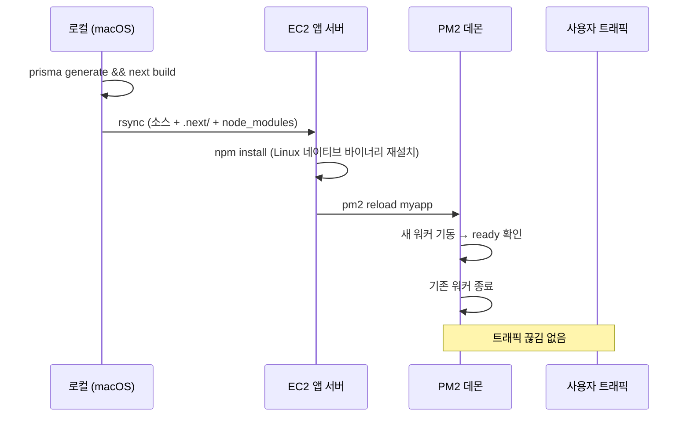

# EC2에 Node.js 앱 올릴 때 PM2를 왜 쓰나요

처음 EC2에 Next.js 앱을 올렸을 때, SSH로 들어가서 `npm start`를 친 다음 SSH 창을 닫는 순간 서버가 죽는 경험을 해보셨을 거예요. `nohup`이나 `screen`으로 어떻게든 띄워도 메모리 누수로 죽으면 그대로 끝이고요. 이 글에서는 그 다음 단계로 자연스럽게 손이 가는 **PM2**가 정확히 무엇을 해주는지, 그리고 실제 운영 중인 ERP 프로젝트에서 PM2를 어떻게 쓰고 있는지 정리해볼게요.

## PM2가 풀어주는 문제

`node server.js`를 직접 실행하면 그 노드 프로세스는 SSH 세션의 자식 프로세스로 묶여요. 세션이 끊기면 SIGHUP을 받고 프로세스도 같이 종료되죠. 그래서 데몬화가 필요하고, 데몬화만 해선 부족하니까 죽었을 때 다시 살려주는 supervisor가 필요해요. PM2는 그 두 가지를 합쳐놓은 도구예요.

정리하면 PM2가 해주는 일은 이래요.

- **데몬화**: 백그라운드에서 띄우고 SSH가 끊겨도 살아있게.
- **자동 재시작**: 프로세스가 죽으면 즉시 다시 띄움. 메모리 임계치를 넘어도 재시작 가능.
- **무중단 재배포**: 새 코드로 교체할 때 트래픽을 끊지 않고 프로세스를 갈아끼움.
- **로그 수집**: stdout/stderr를 파일로 모아주고 `pm2 logs`로 한 번에 봄.
- **서버 재부팅 시 자동 기동**: EC2가 재시작돼도 앱이 알아서 올라옴.

이 다섯 가지를 직접 systemd로 구성할 수도 있지만, Node.js 한정이라면 PM2가 압도적으로 빠르게 같은 결과를 줘요.

## 가장 작은 설치와 기동

운영 중인 ERP 서버의 PM2 버전은 `6.0.14`, 노드는 `v20.20.2`예요. 설치는 글로벌로 한 번.

```bash
npm install -g pm2
```

그 다음 앱을 띄울 땐 이름을 꼭 붙여주세요. 이름이 있어야 `restart`, `logs`, `reload` 같은 명령에서 타겟이 명확해져요.

```bash
cd ~/myapp
NODE_ENV=production pm2 start "tsx src/server.ts" --name myapp
```

ERP 프로젝트에서는 커스텀 서버(`src/server.ts`)를 TypeScript 그대로 `tsx`로 실행하고 있어서 위 형태를 쓰고 있어요. 일반적인 Next.js라면 `pm2 start npm --name myapp -- start` 같은 형태도 가능합니다.

## 매일 쓰는 명령 다섯 개

운영하면서 손에 익는 명령은 사실 다섯 개 정도가 전부예요.

```bash
pm2 status                            # 프로세스 목록과 상태
pm2 restart myapp                     # 다운타임 있는 재시작
pm2 reload myapp                      # 무중단 재시작 (cluster 모드일 때 진가)
pm2 logs myapp                        # 실시간 로그
pm2 logs myapp --lines 50 --nostream  # 최근 로그만 한 번 확인
```

여기서 `restart`와 `reload`의 차이는 알아두면 좋아요. `restart`는 프로세스를 죽이고 다시 띄우니까 그 순간 새 요청은 502를 받아요. `reload`는 새 워커를 먼저 띄워서 ready 상태가 된 다음에 기존 워커를 종료해요. 그래서 사용자 입장에선 끊김이 거의 없어요. 단일 프로세스 모드에서도 reload는 동작하지만 cluster 모드(아래에서 설명)와 결합할 때 진가를 발휘해요.

## 배포 파이프라인 안에서의 PM2

ERP 프로젝트의 배포 흐름을 단순화하면 이래요.



핵심은 마지막 한 줄, `pm2 reload myapp`이에요. 이 한 줄 덕분에 배포 중에도 사용자는 503을 보지 않아요. 만약 `pm2 restart`였다면 새 빌드가 부팅되는 1~3초 동안 들어온 요청이 전부 실패했을 거예요.

## 서버 재부팅에도 살아남게 — `pm2 save` + `startup`

EC2를 재부팅하거나 인스턴스가 어떤 이유로 재시작될 때, PM2 자체가 안 떠 있으면 앱도 안 떠요. 이걸 막는 두 단계가 있어요.

```bash
# 1. 현재 띄워둔 프로세스 목록을 디스크에 저장
pm2 save

# 2. OS 부팅 시 PM2가 자동 기동되도록 systemd 유닛 등록
pm2 startup systemd -u ec2-user --hp /home/ec2-user
# 위 명령이 출력해주는 sudo 명령을 그대로 한 번 더 실행
```

이걸 안 해두면 점검 후 인스턴스를 재부팅했는데 새벽에 알람이 울리는 일이 생겨요. 한 번만 해두면 끝이에요.

## cluster 모드: 코어를 다 쓰고 싶을 때

Node.js는 싱글 스레드 런타임이에요. t3.medium처럼 vCPU가 2개인 인스턴스에서 단일 프로세스로 띄우면 CPU의 절반은 놀아요. PM2 cluster 모드는 같은 앱을 여러 워커로 띄우고 PM2가 그 앞에서 라운드로빈으로 분배해줘요.

```bash
pm2 start "tsx src/server.ts" --name myapp -i max
# -i max 는 vCPU 수만큼, -i 2 처럼 숫자 지정도 가능
```

다만 cluster 모드는 **공유 상태가 없는 stateless 앱**이어야 안전해요. WebSocket을 직접 다루거나 인메모리 캐시에 의존한다면 워커끼리 상태가 갈리면서 문제가 생겨요. ERP 프로젝트는 Socket.IO를 쓰고 있어서 현재는 단일 프로세스로 운영하고 있고, 수평 확장은 Redis adapter를 붙인 다음 도입할 계획이에요.

## ecosystem 파일로 설정을 코드로 관리

명령줄 옵션이 길어지면 `ecosystem.config.js` 한 파일로 빼는 게 깔끔해요.

```js
module.exports = {
  apps: [
    {
      name: "myapp",
      script: "tsx",
      args: "src/server.ts",
      cwd: "/home/ec2-user/myapp",
      env: { NODE_ENV: "production" },
      max_memory_restart: "800M",
      kill_timeout: 5000,
      wait_ready: true,
      listen_timeout: 10000,
    },
  ],
};
```

옵션 세 개만 짚어볼게요.

- `max_memory_restart`: 메모리가 임계치를 넘으면 자동 재시작. 메모리 누수 보험.
- `wait_ready` + `listen_timeout`: 앱이 `process.send('ready')`를 보낼 때까지 reload 가 기다림. 부팅 중인 워커에 트래픽이 가는 사고를 막아줘요.
- `kill_timeout`: graceful shutdown 시간. SIGINT 받고 이만큼 안에 종료 못 하면 SIGKILL.

이 파일을 만들어두면 기동은 `pm2 start ecosystem.config.js` 한 줄이면 끝이에요.

## 처음 배울 때 빠지기 쉬운 함정 세 개

직접 굴리면서 한 번씩 겪은 것들이에요.

1. **이름 없이 띄우기.** `pm2 start server.js`만 하면 PM2가 자동으로 `server`라는 이름을 붙여요. 같은 파일명이 다른 디렉터리에 있거나, 명령을 바꿔서 다시 띄우면 이름이 꼬여요. 처음부터 `--name`을 박는 습관을 들여요.
2. **`pm2 save`를 잊고 재부팅.** 위에서 다룬 그 사고. 처음 PM2를 셋업하는 날 함께 끝내야 해요.
3. **로그 로테이션 미설정.** 기본값으로는 `~/.pm2/logs/`에 무한정 쌓여요. 한 달이면 디스크가 차서 인스턴스가 먹통이 돼요. `pm2 install pm2-logrotate` 한 줄로 해결돼요.

## 정리

PM2는 "Node.js 앱을 EC2에서 안 죽고 살게 해주는 도구"라는 한 줄로 외워도 처음엔 충분해요. 그 위에 reload로 무중단 배포, ecosystem 파일로 설정 관리, cluster 모드로 코어 활용, startup으로 재부팅 생존성까지 차근차근 얹어가면 돼요. 단일 EC2로 시작한 서비스가 ECS/EKS로 넘어가기 전까지는 PM2 한 도구로 운영 부담의 큰 덩어리를 덜 수 있어요.
