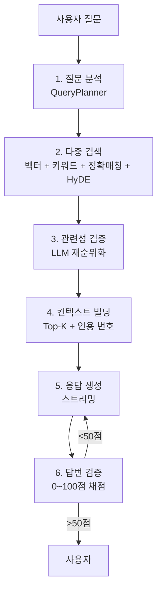

## 한 줄 요약

LLM은 학습 시점 이후의 데이터를 모르고, 모르는 걸 자신있게 지어냅니다. RAG는 "답하기 전에 우리 자료에서 먼저 찾아본 다음 그걸 근거로 말하게" 하는 패턴이에요. 이 글에서는 실제 운영에 쓰는 6단계 파이프라인을 1편으로 정리해요.

---

## 왜 RAG가 필요한가

`gpt-5.4-mini` 같은 LLM에게 "우리 회사 작년 인사 규정 알려줘"라고 물어보면 이런 답이 돌아와요.

- 학습 시점 이후 데이터는 모름
- 사내 비공개 문서는 학습 데이터에 없음
- "모른다"가 아니라 그럴듯한 거짓말을 함 (환각, hallucination)

해결 방법은 두 가지예요.

1. **파인튜닝** — 모델 자체에 우리 데이터를 학습시킴. 비싸고 느리고, 데이터 바뀔 때마다 다시 학습해야 함.
2. **RAG** — 질문이 들어오면 우리 자료에서 관련 문서를 검색해서, 그 문서를 같이 LLM에 넣어주고 답하게 함.

대부분의 사내 챗봇·문서 검색은 RAG가 정답이에요. 데이터를 실시간으로 갈아끼울 수 있고, 출처를 함께 보여줄 수 있고, 무엇보다 싸요.

---

## 가장 단순한 RAG

RAG의 본질은 단 3단계예요.

```
사용자 질문
   ↓
[검색] 우리 자료에서 관련 문서 N개를 가져옴
   ↓
[프롬프트 조립] "다음 문서를 참고해서 답해줘:\n{문서}\n질문: {질문}"
   ↓
[LLM 생성] 답변
```

이걸로 데모 수준은 만들어져요. 그런데 실제 서비스에 올리는 순간 "검색이 엉뚱한 문서를 잡아온다", "LLM이 검색 결과를 무시하고 환각한다", "간단한 질문에 너무 느리다" 같은 문제가 줄줄이 터져요.

그래서 운영용 RAG는 검색 앞뒤로 단계가 더 붙어요.

---

## 운영용 6단계 파이프라인

제가 법률 도메인 RAG 챗봇을 만들면서 정리한 파이프라인이에요. 6단계로 늘렸지만, 결국 "검색을 잘하기 위한 전처리"와 "생성을 잘하기 위한 후처리"가 붙은 형태예요.



하나씩 짚어볼게요.

### 1. 질문 분석 (Query Planner)

사용자가 던지는 질문은 검색용 쿼리로 바로 쓰기엔 너무 거칠어요. 예를 들면 이런 질문이요.

> "김철수 씨가 작년에 제기한 1심 판결문에서 핵심 쟁점이 뭐였어?"

여기엔 검색 시그널이 여러 개 섞여 있어요. 사람 이름, 시점, 문서 유형, 핵심 키워드. 이걸 LLM(`gpt-4o-mini` 같은 작은 모델)에게 분석시켜서 구조화된 JSON으로 뽑아내요.

```json
{
  "rewritten_query": "1심 판결문 핵심 쟁점 요약",
  "query_mode": "keyword_heavy",
  "person_names": ["김철수"],
  "document_types": ["판결문"],
  "keywords": ["1심", "핵심 쟁점"],
  "search_strategies": ["keyword", "vector", "exact"]
}
```

이 메타데이터는 뒤 단계의 검색·필터링에 모두 활용돼요. 특히 `query_mode`로 "이번 질문은 키워드 검색을 더 믿을지, 벡터 검색을 더 믿을지" 가중치를 조절해요.

### 2. 다중 검색 (Hybrid Retrieval)

여기가 RAG의 심장이에요. 한 가지 검색만 쓰면 반드시 새는 케이스가 있어요.

| 검색 방법 | 잘하는 것 | 못하는 것 |
|---------|---------|---------|
| 벡터 검색 (Qdrant) | 의미 유사도 — "해고 부당함" ≈ "정당하지 않은 면직" | 고유명사, 사건번호 |
| 키워드 검색 (Postgres BM25) | 정확한 단어 매칭, 사건번호 | 동의어·유의어 |
| 정확 매칭 | 사건명·당사자명 완전 일치 | 변형된 표기 |
| HyDE | 짧은 쿼리 ↔ 긴 문서 갭 줄이기 | 비용 (LLM 1회 추가) |

각각 후보를 40건씩 뽑아서 다음 단계로 넘겨요. **HyDE**는 2편에서 자세히 다룰 텐데, 한 줄로 말하면 "쿼리를 가상의 답변 문서로 변환해서 그걸 임베딩"하는 기법이에요.

### 3. 관련성 검증 (Relevance Verification)

검색은 후보를 많이 뽑아주지만, 그중 정말 관련 있는 건 일부예요. 100건 뽑았는데 90건이 노이즈면 그대로 LLM에 넣으면 안 돼요.

그래서 `gpt-4o-mini`로 한 번 더 거릅니다. 후보 각각에 대해 "이 문서가 사용자 질문과 관련 있어?"를 LLM에게 물어보고, 관련 없으면 떨궈요. 검증이 통째로 실패하면 최소 4건은 fallback으로 통과시켜요 — 0건 반환하는 게 가장 나쁜 시나리오라서요.

### 4. 컨텍스트 빌딩 (Context Building)

살아남은 Top-K(보통 5건)를 LLM 프롬프트에 넣을 형태로 조립해요. 핵심은 두 가지예요.

- **인용 번호 부여**: `[1]`, `[2]`, ... 을 붙여서 LLM이 답변에 인용을 자연스럽게 달 수 있게.
- **외부 API 결과 합치기**: 외부 법령 API(`example.com/law/api` 같은 곳)에서 관련 조항 원문을 가져와서 같이 넣음.

이 단계에서 컨텍스트 윈도우(보통 수십만 토큰)를 어떻게 효율적으로 채울지가 비용을 결정해요.

### 5. 응답 생성 (Generation)

진짜 답을 만드는 단계. `gpt-5.4-mini` 같은 좀 더 큰 모델로 스트리밍 응답을 만들어요. 시스템 프롬프트에는 보통 이런 내용이 들어가요.

- "참고 자료의 출처를 [1], [2] 형태로 인용해"
- "근거가 부족하면 추측하지 말고 '확인 불가'라고 답해"
- 대화 히스토리 최근 5턴

스트리밍을 쓰는 이유는 단순해요 — RAG 응답은 검색까지 합치면 3~10초가 걸려서, 한꺼번에 보여주면 사용자가 느려 보인다고 느껴요. 토큰 단위로 흘려보내면 1초 안에 첫 글자가 나와서 체감 속도가 확 빨라져요.

### 6. 답변 검증 (Answer Verification)

여기가 의외로 중요해요. LLM이 컨텍스트를 줘도 환각을 하는 경우가 있거든요. 그래서 답변이 다 만들어진 뒤에 다시 한 번 LLM에게 물어봐요.

> "이 답변에 나온 주장들이 검색된 문서에 근거가 있어? 0~100점으로 매겨줘."

50점 이하면 자동 재생성을 돌려요. 점수와 함께 "근거가 약한 주장 목록(flagged claims)"도 사용자에게 표시해서 신뢰도를 솔직하게 드러내요. 100점 만점을 강요하지 말고, "70점짜리 답이지만 이 부분은 약하다"를 보여주는 게 사용자 신뢰에 훨씬 좋아요.

---

## 하이브리드 검색이 왜 둘 다 필요한가

가장 자주 질문받는 부분이라 따로 떼서 정리해요.

**벡터 검색만 쓸 때 망하는 케이스:**

```
질문: "2024구합12345 사건 결과 알려줘"
벡터 검색: "사건 결과"의 의미적 유사 문서를 잔뜩 가져옴
→ 정작 2024구합12345 사건번호와 무관한 문서들
```

사건번호 같은 고유 토큰은 임베딩 공간에서 의미를 잘 표현 못해요. 단순 문자열 매칭이 더 정확해요.

**키워드 검색만 쓸 때 망하는 케이스:**

```
질문: "부당하게 잘린 사례 있어?"
키워드 검색: "부당하게", "잘린", "사례" 단어가 든 문서를 찾음
→ 정작 "정당한 사유 없는 해고" 같은 더 정확한 표현은 놓침
```

표현이 다르지만 의미가 같은 문서를 못 잡아요.

**그래서 둘 다 돌리고 합칩니다.** 그런데 점수 체계가 다르잖아요 — 코사인 유사도는 0~1, BM25는 0~∞. 이걸 어떻게 합치냐가 문제예요.

## RRF — Reciprocal Rank Fusion

가장 단순한 정답이 **RRF(Reciprocal Rank Fusion)**예요. 점수 자체를 합치는 게 아니라 **순위**를 합쳐요.

```python
def rrf_score(rank: int, k: int = 60) -> float:
    return 1 / (k + rank)

# 벡터 검색 1위, 키워드 검색 5위 문서 → 1/(60+1) + 1/(60+5) = 0.0317
# 벡터 검색 3위, 키워드 검색 2위 문서 → 1/(60+3) + 1/(60+2) = 0.0320
```

서로 다른 점수 스케일을 신경 쓸 필요가 없고, "두 검색이 모두 상위로 올린 문서"가 자연스럽게 위로 올라와요. `k=60`은 거의 표준값이고 그대로 써도 잘 동작해요.

---

## 정리

RAG 데모는 30분이면 만들어요. 그런데 운영용은 다음을 더 신경 써야 해요.

- 쿼리를 그대로 검색에 쓰지 말고 한 번 분석하기 (1단계)
- 벡터 + 키워드 + 정확 매칭을 같이 돌리고 RRF로 섞기 (2단계)
- 검색 결과를 LLM으로 한 번 더 거르기 (3단계)
- 답변이 끝난 뒤 다시 검증하기 (6단계)

각 단계를 LLM 한 번씩 더 쓰는 만큼 비용이 늘어요. 보통 한 질문에 작은 모델 3~4회 + 큰 모델 1회가 들어가요. 이게 비싸 보이지만, 환각이 생기는 것보다 훨씬 싸요.

다음 편에서는 검색 정확도를 결정짓는 **청킹과 임베딩 전략**을 다룰게요. "GPU 없이 OpenAI 임베딩만으로도 파인튜닝 효과의 85~90%를 낼 수 있다"는 입력 가공 6가지 기법이에요.

---

## 시리즈 다른 편

- 1편 (현재 글)
- 2편. 청크를 어떻게 자르고 임베딩할 것인가 (예정)
- 3편. 고정 파이프라인 vs Tool Calling (예정)
- 4편. 운영에서 만나는 RAG — 임베딩 파이프라인 4경로 (예정)
