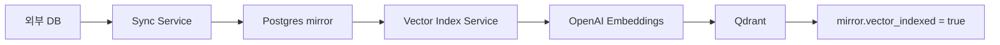
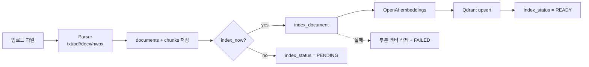
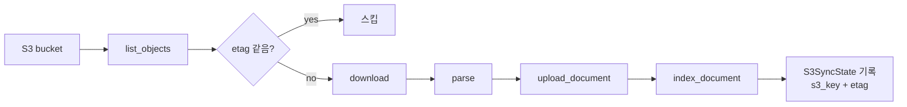

## 한 줄 요약

1~3편은 "검색을 어떻게 잘하느냐"였어요. 막상 운영에 올리면 그것 못지않게 중요한 게 따로 있어요. **임베딩을 어떻게 채우고, 실패하면 어떻게 회복하고, 비용을 어떻게 통제하느냐**. 이 글에서는 실제로 굴려보면서 만난 임베딩 파이프라인 4가지 경로와 그 함정을 정리해요.

---

## 임베딩은 "한 번 만들고 끝"이 아니다

RAG 데모를 만들 땐 보통 이런 식이에요.

```
1. 문서 파일 한 폴더에 모아둔다
2. 스크립트 한 번 돌려서 다 임베딩한다
3. Qdrant에 다 넣는다
4. 끝!
```

이게 운영에 올라가는 순간 안 통해요. 실제 운영에서는 데이터가 끊임없이 들어오고, 형태도 다양하고, 실패도 나요.

- 사내 시스템에서 매일 새 데이터가 쌓여요
- 사용자가 직접 문서를 업로드해요
- 외부 저장소에 파일이 매일 추가돼요
- 그 사이 임베딩 API가 가끔 죽어요

그래서 보통 RAG 시스템에는 **임베딩 트리거가 여러 개** 있어요. 그리고 각자 다른 함정이 있어요.

---

## 경로 1. 외부 DB 동기화 → 자동 인덱싱

가장 흔한 패턴. 사내 데이터베이스나 ERP가 진짜 원본이고, RAG는 그걸 복사해서 임베딩만 추가해요.



흐름은 두 단계예요.

1. **데이터 동기화**: 외부 DB에서 데이터를 읽어서 Postgres 미러 테이블에 upsert. `vector_indexed=False`로 저장.
2. **벡터 인덱싱**: `vector_indexed=False`인 문서만 골라서 임베딩 → Qdrant 업서트 → `vector_indexed=True`로 갱신.

이렇게 두 단계로 나누는 이유가 있어요. **데이터 동기화는 자주, 임베딩은 가끔** 돌리고 싶거든요. 임베딩은 비용이 들지만, 동기화는 거의 공짜니까요.

**함정 1: 운영 환경에서만 자동 스케줄러 켜기**

```python
if APP_ENV == "development":
    scheduler.disable()  # dev에서는 자동 동기화 끔
```

dev에서 자동 스케줄러가 돌면 매번 임베딩 API 비용이 나가요. 더 큰 문제는 dev DB의 테스트 데이터까지 임베딩돼서 운영 인덱스를 더럽힐 수 있다는 거예요. 환경별 분리는 첫날부터 해두세요.

**함정 2: 어디까지 동기화했는지 커서 관리**

매일 전체를 다시 동기화할 순 없어요. `last_synced_id` 같은 커서를 두고 증분만 가져와요. 이게 깨지면 같은 데이터를 중복 임베딩하거나 누락해요. 커서는 별도 메타 테이블에 두고 트랜잭션으로 갱신하세요.

---

## 경로 2. dev 샘플 임베딩 — 전체 비용 없이 검증

운영 데이터가 수십만 건일 때, dev에서 전체를 임베딩하면 안 돼요. 비용도 비용이지만, 시간도 오래 걸려요.

해결책: **source type별 샘플 N건만 임베딩**.

```
운영 데이터 수십만 건
       ↓
[샘플 import] source type별 최신 10건씩만 가져옴
       ↓
[Postgres에 dev_sample::<batch_id>::<type> 형태로 저장]
       ↓
[해당 batch_id만 골라서 임베딩]
```

핵심은 **운영 동기화 커서와 dev 샘플을 분리**하는 거예요. dev 샘플 적재할 때 `source_table` 컬럼에 `dev_sample::<batch_id>::...` 같은 prefix를 박아요. 그러면 운영 동기화 로직이 dev 샘플을 건드리지 않아요. dev 샘플을 다 지우고 다시 만들어도 운영 커서가 깨지지 않아요.

이거 안 해두면 dev에서 한 번 테스트할 때마다 운영 데이터 흐름을 손대게 돼요. 두고두고 후회해요.

---

## 경로 3. 사용자 업로드 → 즉시 인덱싱

관리자가 직접 문서를 올리는 경우.



API 호출은 단순해요.

```
POST /api/v1/documents?index=true
```

`index=true`면 즉시 임베딩, `false`면 일단 저장만 하고 나중에 배치로 처리.

**함정 1: 부분 실패 처리**

청크가 100개인 문서를 임베딩하다가 50번째에서 API가 죽으면? 50개는 Qdrant에 들어가 있고, 나머지 50개는 없어요. 이 상태로 검색하면 절반만 매칭되는 이상한 결과가 나와요.

해결: **실패하면 부분 벡터를 삭제하고 문서 상태를 FAILED로 마킹**.

```python
try:
    embeddings = await embed_texts(chunks)
    await qdrant.upsert(...)
    document.index_status = "READY"
except Exception as e:
    await qdrant.delete_by_document_id(document.id)
    document.index_status = "FAILED"
    document.metadata["last_index_error"] = str(e)
```

"전부 성공" 아니면 "전부 없음" 둘 중 하나. 어중간한 상태가 가장 나빠요.

**함정 2: FAILED 문서 가시화**

FAILED로 마킹만 해두고 끝내면 아무도 모르게 묻혀요. 관리자 화면에 FAILED 목록을 항상 보여주고, `last_index_error`도 같이 띄우세요. 재시도 버튼도 박아두면 더 좋아요.

---

## 경로 4. S3 sync (pull 방식)

이미 S3 버킷에 쌓여 있는 파일을 RAG로 끌어들이는 경로. 사내에서는 NAS → S3 → RAG 같은 구조를 자주 써요.



**핵심은 `etag` 비교예요.** S3 객체에는 ETag(보통 MD5)가 붙어 있어요. 이전 동기화 때 기록해둔 ETag와 같으면 파일이 안 바뀐 거니까 스킵해요. 다르면 다시 다운로드해서 재임베딩.

이걸 안 하면 S3 sync 돌릴 때마다 전체를 다시 임베딩해요. 임베딩 비용이 폭발해요.

**함정: pull 방식의 시간 지연**

S3 sync는 push가 아니라 pull이에요. 누가 S3에 파일을 올려도 RAG가 자동으로 알지 못해요. 스케줄러로 주기적으로 list_objects를 돌리거나, S3 이벤트 알림(SNS/SQS)을 받아서 트리거해야 해요.

스케줄로 돌리면 "방금 올린 파일이 검색이 안 돼요" 클레임이 와요. 사용자가 직접 "지금 동기화" 버튼을 누를 수 있는 관리자 화면이 있으면 좋아요.

---

## 경로 비교 한눈에

| 경로 | 트리거 | 데이터 출처 | 자동/수동 | 함정 |
|------|--------|------------|----------|------|
| 1. 외부 DB 동기화 | 스케줄러 | 사내 DB | 자동 | 환경별 스케줄러, 커서 관리 |
| 2. dev 샘플 | 관리자 액션 | 사내 DB 일부 | 수동 | 운영 커서와 섞이면 안 됨 |
| 3. 사용자 업로드 | API 호출 | 업로드 파일 | 즉시 | 부분 실패, FAILED 가시화 |
| 4. S3 sync | 스케줄러 + 수동 | S3 객체 | pull | ETag 비교, 시간 지연 |

대부분의 운영 RAG는 이 4개 중 2~3개를 동시에 굴려요. 각자가 만들어내는 함정이 달라서, 한 번씩 다 겪어보고 나서야 안정화돼요.

---

## 리인덱싱 — 한 번에 다 돌리지 마라

청킹 전략이나 임베딩 prefix를 바꾸면 기존 데이터를 재임베딩해야 해요. 2편의 메타데이터 주입 임베딩이나 Parent-Child 청킹을 적용할 때 무조건 필요한 작업이에요.

리인덱싱 스크립트는 **세 가지 옵션은 무조건 박아두세요**.

```bash
# dry-run: 실제 변경 없이 분포만 확인
python -m scripts.reindex --dry-run --limit 5

# 특정 문서만
python -m scripts.reindex --document-id <uuid>

# 전체 (소규모 검증 후에만)
python -m scripts.reindex
```

- `--dry-run`: 청크가 어떻게 잘리는지 출력만 하고 임베딩 API는 안 부름. 청킹 로직 검증용.
- `--limit N`: 처음 N건만 처리. 동작 확인용.
- `--document-id`: 특정 문서만. 문제 디버깅용.

이 옵션들 없이 전체 리인덱싱부터 돌리면, 잘못된 로직으로 수십만 건을 다시 임베딩하고 비용 청구서를 봐요. 그리고 다시 고쳐서 또 돌려요. 비용이 두 배예요.

**Parent-Child를 도입할 때 비용 주의**

2편에서 본 Parent-Child 청킹은 child를 1024자로 만들면 기존 3072자 청크보다 임베딩 호출이 **약 3배** 늘어요. 전체 리인덱싱 비용도 3배예요. dry-run으로 청크 수 예상치를 먼저 보고, 비용 시뮬레이션부터 하세요.

---

## 비용 통제 포인트 5가지

운영하면서 비용이 새는 자리 정리.

**1. 임베딩 모델 차원 — `text-embedding-3-large` (3072d) vs `small` (1536d)**

`large`가 정확도가 높긴 한데 비용도 차원 증가에 비례해요. 도메인이 단순하면 `small`로도 충분해요. 처음엔 `large`로 시작해서 정확도를 확인하고, 정확도 갭이 작으면 `small`로 갈아타는 게 안전해요.

**2. HyDE 끄기 옵션**

2편의 HyDE는 쿼리당 LLM 1회를 더 써요. 검색 정확도를 많이 올려주지만, 비용이 부담되면 환경변수로 끌 수 있게 해두세요.

```python
# config.py
RAG_HYDE_ENABLED: bool = True  # .env에서 false로 오버라이드 가능
```

비용 모니터링하다가 분기별로 켰다 껐다 할 수 있어야 해요.

**3. 답변 검증 자동 재생성의 함정**

1편의 6단계 답변 검증을 떠올려보세요. 점수 ≤50점이면 자동 재생성해요. 그런데 만약 어떤 질문 유형이 항상 점수가 낮게 나오면? 매번 재생성이 돌고, **응답 생성 비용이 2배**가 돼요.

해결: 재생성 회수 상한(보통 1회)을 두고, 어떤 질문에서 자주 재생성되는지 모니터링하세요. 재생성률이 높은 질문 패턴을 찾으면 프롬프트나 검색 전략 자체를 손봐야 해요.

**4. 채팅 히스토리 무한 누적 방지**

대화가 길어지면 messages 배열이 커지고, 매 호출마다 누적된 모든 메시지가 토큰으로 들어가요. **최근 N턴(보통 5턴)만 유지**하세요. 그 이상은 요약본 1개로 압축해서 넣는 식으로 처리.

**5. 임베딩 캐싱**

같은 텍스트를 임베딩하는 일이 의외로 많아요. 동기화 재실행, 리인덱싱, 같은 쿼리 반복 등. 해시 기반 캐시를 깔아두면 API 호출이 확 줄어요. Redis 캐시 한 줄로 끝나요.

---

## 검증 점수 기반 자동 재생성의 함정

이거 따로 떼서 좀 더 강조할게요. 1편의 답변 검증 6단계는 좋은 안전장치예요. 그런데 **자동 재생성을 잘못 깔면 더 큰 문제**를 만들어요.

문제 패턴 예시.

> 사용자 질문이 검색 가능한 자료가 부족한 영역이에요. 답변이 추측 기반으로 나가요. 검증기가 "근거 부족 70점"이라고 채점해요. 50점 이하가 아니니 통과. 그래서 사용자에게는 부정확한 답이 갑니다.

또 다른 패턴.

> 검증기가 50점 아래로 채점. 재생성. 같은 컨텍스트로 다시 생성하니 또 부정확. 다시 50점 아래. 재생성. 무한 루프 가까이.

해결책 세 가지.

1. **재생성 회수 1회로 제한** (재생성해도 또 낮으면 점수와 함께 그대로 사용자에게)
2. **점수와 flagged_claims를 사용자에게 노출** ("이 부분은 근거가 약합니다" UI 표시)
3. **재생성률 모니터링** (재생성 비율 ≥ 20%면 알람)

검증 점수는 "재생성 트리거"가 아니라 "사용자에게 보여줄 신뢰도 지표"로 보는 게 더 안전해요.

---

## 시리즈 마무리

4편에 걸쳐 정리한 RAG 흐름.

- **1편**: 운영용 6단계 파이프라인 (질문 분석부터 답변 검증까지)
- **2편**: GPU 없이 입력 가공만으로 정확도 올리는 6가지 기법
- **3편**: 고정 파이프라인 대신 LLM에게 자율 도구 선택을 맡기는 Tool Calling 패턴
- **4편**: 운영 관점 — 임베딩 파이프라인 4경로, 리인덱싱, 비용 통제

처음 RAG를 만들면 보통 "검색 정확도"에만 신경 써요. 그런데 운영을 시작하면 정확도 못지않게 비용, 실패 복구, 데이터 수명 관리가 큰 비중을 차지해요. 4편에서 다룬 함정들은 한 번씩 다 겪고 나서야 정리한 것들이에요. 미리 알아두면 같은 자리에서 안 깨질 거예요.

다음 단계로 가고 싶다면 추천 방향.

- **평가 데이터셋 만들기**: 자체 벤치마크 100건 정도. recall@5, MRR로 변경의 효과를 수치로 검증.
- **사용자 피드백 루프**: thumbs up/down 수집 → 검색 품질 데이터로 활용.
- **리랭킹 모델 도입**: cross-encoder로 1차 검색 결과를 재순위화하면 정확도 추가 향상.
- **시맨틱 캐싱**: 유사 쿼리를 캐시해서 응답 속도 + 비용 모두 개선.

RAG는 한 번 깔면 끝이 아니라, 데이터·도메인·사용자 패턴에 맞춰 계속 다듬는 시스템이에요. 이 시리즈가 그 출발선에 도움이 됐으면 좋겠어요.

---

## 시리즈 다른 편

- [1편. RAG가 뭐고 왜 쓰는가 — 기본 파이프라인 6단계](/blog/rag-series-1-pipeline-basics)
- [2편. 청크를 어떻게 자르고 임베딩할 것인가](/blog/rag-series-2-chunking-and-embedding)
- [3편. 고정 파이프라인 vs Tool Calling](/blog/rag-series-3-tool-calling)
- 4편 (현재 글)
